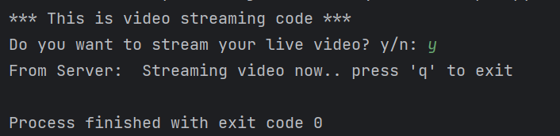
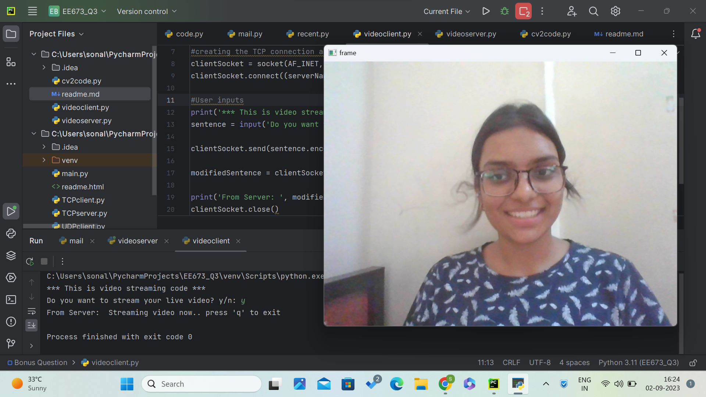
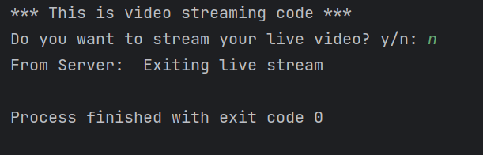

# Question (Bonus): Video Streaming
#### Design a simple live video streaming application using socket programming.

**Steps to run the codes:**
1. Run the *videoserver.p*y file. 
   1. `If it shows "OSError: [WinError 10048] Only one usage of each socket address (protocol/network address/port) is normally permitted" error : assign some new random port number in both videoclient and videoserver file`
2. Server should reply with : "The server is ready to receive"
3. Run _videoclient.py_

4. Output will look something like this (Choose '**y**' to start video streaming) :
 
5. Video streaming starts: 

6. Enter '**q**' to exit live video streaming.

7. If you choose '**n**' : server replies with "Exiting live stream"
