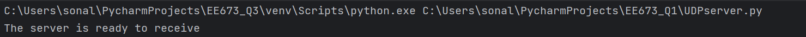
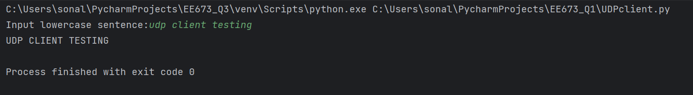
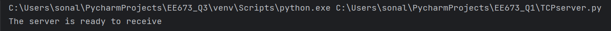
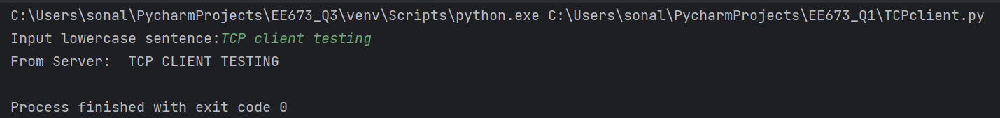

# Question 1: Basics of Socket Programming

Refer to the UDP and TCP socket programming examples given in Section
2.7 of Computer Networking A Top-Down Approach 8th Edition, Kurose
and Ross. Using the above examples, create UDP and TCP client and server
applications where:
 - The client reads a line of characters from its keyboard and sends the
data to the server
 - The server receives the data and converts the characters into uppercase
- Server sends the modified data to the client
- The client receives the modified data and displays the line on its screen

**Steps to run the codes:** 

There are 4 files: _UDPserver.py, UDPclient.py, TCPserver.py, TCPclient.py_

### A. UDP: 
1. Run _UDPserver.py_
    
1. Run _UDPclient.py_ and enter a lowecase sentence - press **Enter**
3. Output: (upppercase sentence)

### B. TCP: 
1. Run _TCPserver.py_
    
1. Run _TCPclient.py_ and enter a lowecase sentence - press **Enter**
3. Output: (upppercase sentence)
