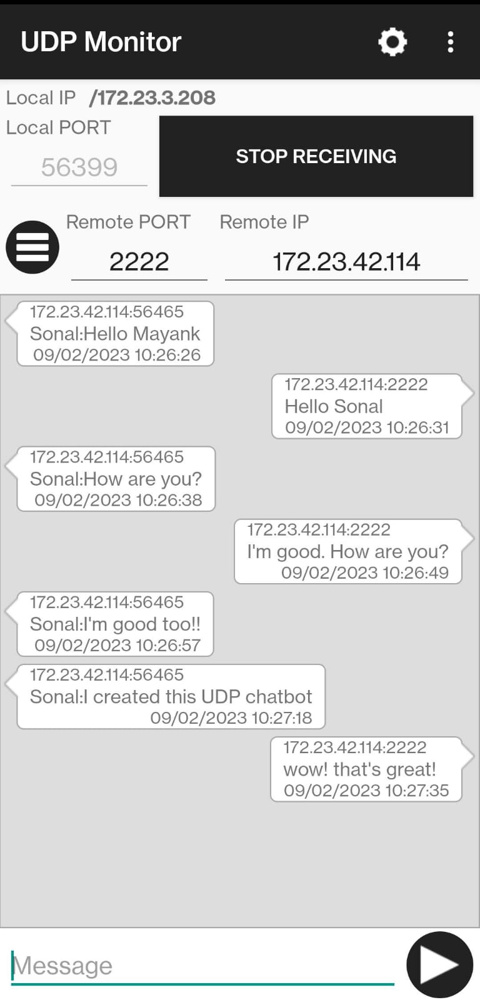
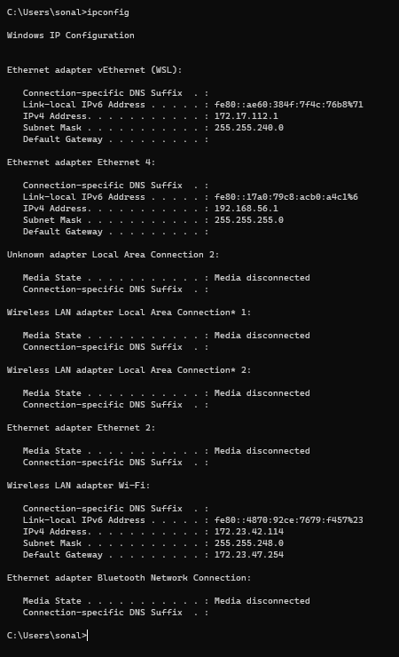
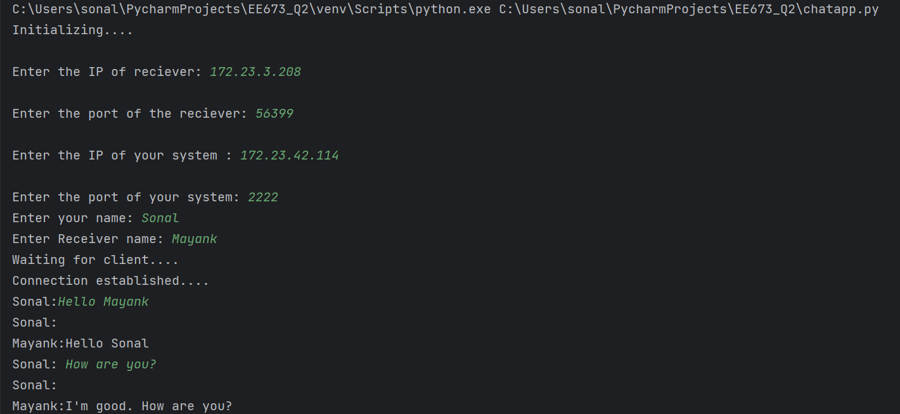
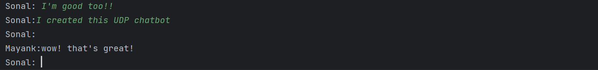

# Question 2: UDP Chat application

Create a UDP chat application for communicating with your phone using
the UDP monitor
 - Install the UDP monitor application on your android phone. Connect
your phone and PC such that they are on the same network. This can
be done either by
   1. Connecting them to the same wifi network
   2. Connecting your PC to phone’s mobile hot-spot, or
   3. Connecting phone and PC via USB tethering

 - Once you ensure phone and PC are on the same network, open the
UDP monitor application on the phone.
 - The IPv4 address of your phone will be displayed on the top left corner.
Also select the local port on the phone. Use this address while designing
your UDP chat application.
 - For two way communication give the remote address and port of your
PC in the UDP monitor mobile application.
Design a two way chat application with the UDP monitor

Final Output: 

  
**Steps to run the code:**
1. Download and open UDP monitor app on your mobile 
2. Connect your mobile and PC on the same network - WiFi/ Hotspot.
2. You will see Local IP and Local PORT on your mobile device (Enter any random Local Port number - ex. I have used 56399, Local IP is prefilled.)
4. Find the Remote IP address (IP of your PC using command prompt using `ipconfig`) and choose a random remote IP -  fill both details in the UDP monitor app and press - START RECEIVING
   

If you're using WiFi - Enter the _IPv4 Address_ under _Wireless LAN adapter Wi-Fi_ section in the above screenshot
5. Run the file _chatapp.py_
6. Enter all details as asked
7. Enter the sender and receiver names and start chatting!

