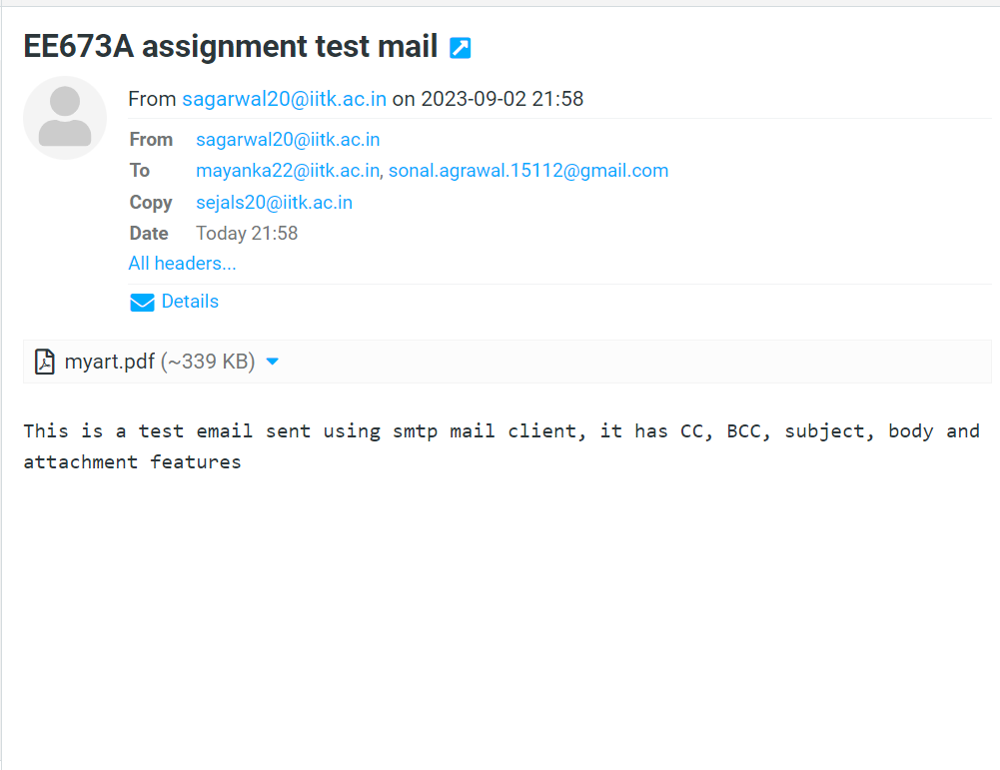
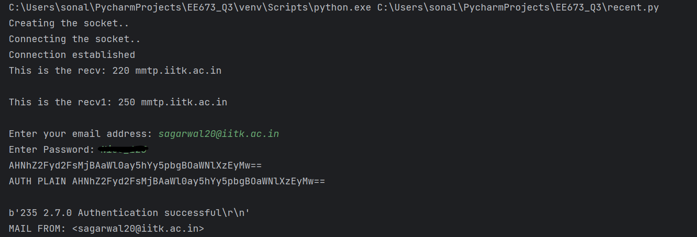
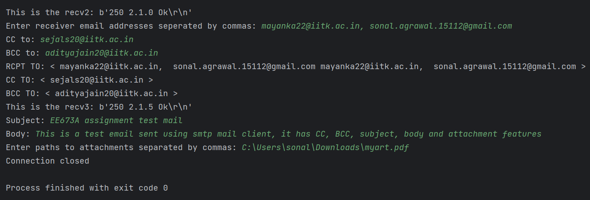

# Question 3: Mail Client

The goal of this question is to create a simple mail client that sends email
to any recipient. Your client will need to establish a TCP connection with
a mail server (e.g., iitk mail server: mmtp.iitk.ac.in), dialogue with the mail
server using the SMTP protocol, send an email message to a recipient (e.g.,
your friend) via the mail server, and finally close the TCP connection with
the mail server.

Your job is to code and test your client by sending email to different user accounts. Incorporate the following features of email in your code: (i) Subject,
(ii) cc or bcc, (iii) attachments.

Output of email received:

**Steps to run the code:**
1. Run the _mailclient.py_
2. Enter your email address and password.
3. Enter receiver details - To ,BCC ,CC ,Subject, Body
4. Enter path of attachment 

Console output: 

_(You will receive check messages at regular intervals for correct functioning of the code)_